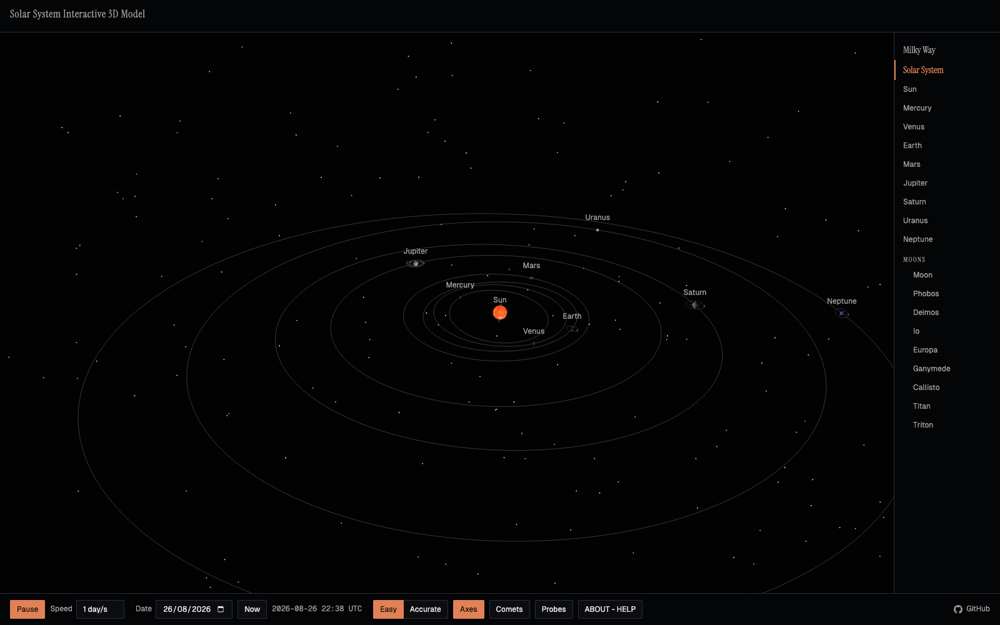
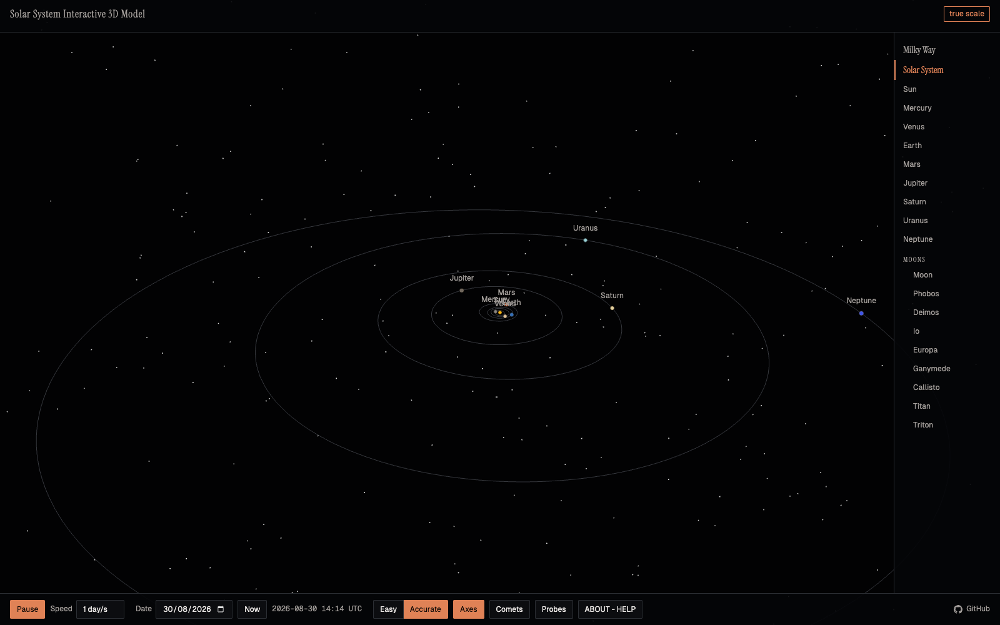
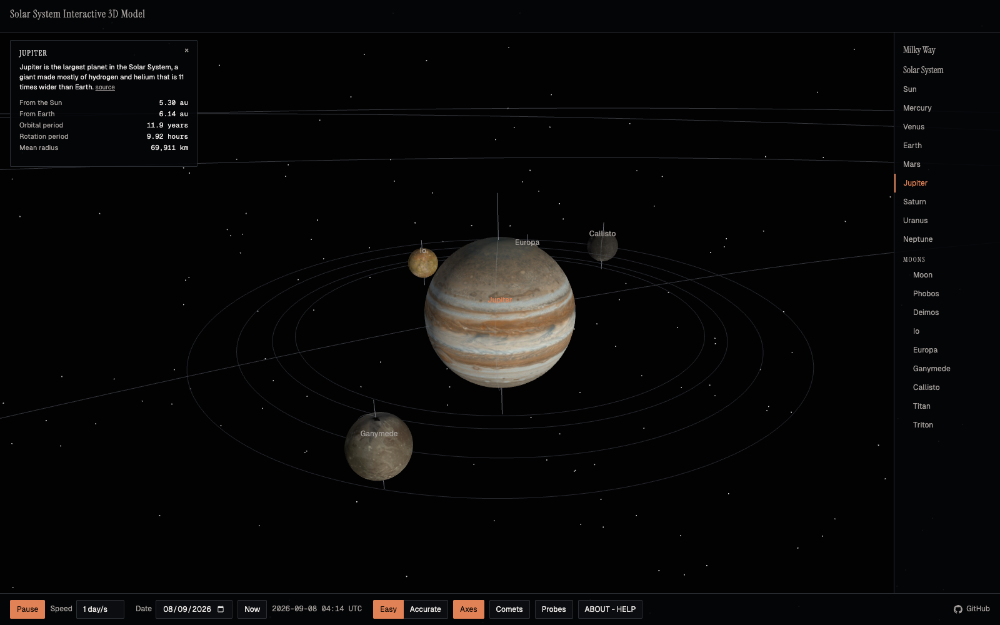

# Interactive Solar System 3D Model

[](LICENSE)
[](DATA-SOURCES.md)

A scientifically honest solar system simulator for the browser. Real JPL orbital
elements drive the planets, every number in the data files carries its source, and
the one thing most simulators hide, the true emptiness of space, is a mode you can
switch on.

Built with [three.js](https://threejs.org/), no build step, no third-party
runtime requests, a folder of static files.

Running at [astro.observer/orrery](https://astro.observer/orrery/).

## Screenshots

[](screenshots/easy-mode.png)

[](screenshots/accurate-mode.png)

[](screenshots/jupiter.png)

## Quick start

Any static file server from the project root:

```bash
python3 -m http.server 8322
```

Open http://localhost:8322. No dependencies, no build.

## Features

- Eight planets propagated from the JPL "Approximate Positions of the Planets"
  Keplerian elements and per-century rates (epoch J2000, valid 1800 to 2050; the
  UI clamps the date range and says so).
- Nine major moons (Moon, Phobos, Deimos, Io, Europa, Ganymede, Callisto, Titan,
  Triton) as circular-inclined orbits, labelled approximate in the interface.
- Two scale modes. Easy compresses distances and enlarges bodies on one stated
  power law so the system is navigable. Accurate is true scale: distances and
  radii in real proportion, with labels and fly-to keeping the dots findable.
- Time controls: play, pause, speeds from real time to a month per second, date
  picker, jump to now. Axial tilts and sidereal rotation, retrograde spins
  included (Venus, Uranus, Triton).
- Orientation indicators (rotation axis and prime meridian) on every body with
  WGCCRE elements, toggled from the control bar, on by default.
- Five well-known comets (Halley, Encke, Churyumov-Gerasimenko, Hale-Bopp,
  Swift-Tuttle) propagated from JPL Small-Body Database osculating elements,
  under a control-bar Comets toggle, off by default, shared with the
  photographed comets from `skymap.json` when that file is present.
- Four spacecraft (Voyager 1, Voyager 2, Cassini, New Horizons) from sampled
  JPL Horizons trajectories: each craft draws its recorded path and a marker
  interpolated along it, shown only within its mission's ephemeris span, and
  can be followed like any body. Mars rover pins mark Perseverance and
  Curiosity at their published waypoint coordinates when the camera is near
  Mars. A control-bar Probes toggle, off by default, governs the layer.
- An info card for the selected body (from the list or by clicking it in the
  scene): a one-sentence description with its source link, live distances
  from the Sun and Earth, and orbital period, rotation period and mean radius
  where the data carries them; spacecraft show their mission note instead.
- Camera fly-to for every body from the side list, following while time runs.
  A Solar System entry in the list, and the Escape key, return the camera
  to the overview and stop following.
- A static galactic context view under a Milky Way entry above Solar System: a
  top-down sketch of the seven spiral arm fits of Reid et al. 2019 (ApJ 885,
  131, Table 2), each drawn only over its fitted azimuth range, with
  Sagittarius A* at the centre, the Sun at its measured 8277 pc from it
  (GRAVITY collaboration 2022) and an arrow along the direction of galactic
  rotation. A view swap, not a zoom (single precision cannot hold the
  galactic-centre distance and a planetary position in one frame); the
  planetary layers hide behind it and System, a body selection or Escape
  restores them, resuming any follow. No orbit is drawn around the centre:
  the Sun's galactic orbit does not close. Sources in
  [DATA-SOURCES.md](DATA-SOURCES.md).
- The view persists across visits: scale mode, toggles, speed, play state,
  simulated time, camera and followed body come back on reload (see below).
- An ABOUT - HELP panel from the control bar: how to use the model as fine
  print at the top, then a plain-language description and the site links, with
  the technical notes under them. The same usage list shows once as a
  dismissible card on a first arrival, and not again after it is closed.
- Optional photo strips: a `photos.json` file links bodies to gallery
  photographs, shown above the control bar while a listed body is followed
  (see below).
- Optional photo sky-mapping: a `skymap.json` file adds comets as followable
  bodies propagated from JPL SBDB osculating elements, deep-sky thumbnail
  markers along real ICRS directions, and location pins on Earth's globe
  (see below).
- Real surface maps: public-domain USGS Astrogeology and NASA global mosaics
  on fifteen bodies, each aligned so the map's prime meridian sits on the
  body's true WGCCRE prime meridian; bodies without a public-domain map
  (Uranus, Neptune, Deimos) keep a flat colour (see `textures/SOURCES.md`).
- Saturn's ring, orbit lines computed from the same elements that move the
  planets, a presentational starfield.

## Photo strips (optional)

A `photos.json` file next to `index.html` is optional site configuration. When
it exists and a body listed in it is being followed, a strip above the control
bar shows the body's label, up to five lazily loaded thumbnails linking to
their photograph pages, and an "all N" link to the body's gallery page, where
N is the number of images listed. Without the file the feature is off and a
single console line states the file is absent; a file that exists but is
malformed is a visible error, never ignored.

```json
{
  "bodies": {
    "jupiter": {
      "label": "Jupiter photographs",
      "gallery_link": "/gallery/jupiter/",
      "images": [
        {
          "slug": "jupiter-at-opposition",
          "thumb": "/gallery/jupiter/thumbs/opposition.jpg",
          "link": "/gallery/jupiter/opposition/",
          "title": "Jupiter at opposition"
        }
      ]
    }
  }
}
```

Keys of `bodies` are body names as they appear in the interface, lower case;
comet bodies from `skymap.json` are keyed by the `body` value stored there
instead. `title` becomes the thumbnail's alt text; `slug` is optional
metadata.

## Photo sky-mapping (optional)

A `skymap.json` file next to `index.html` is optional site configuration
mapping gallery photographs into the model. It carries one `objects` object
keyed by gallery slug. Every entry has a `type`, the gallery `title`, a
`thumb` image path, a `link` to the photograph, and per-type positional data
whose source URL it keeps:

- `"comet"`: JPL Small-Body Database osculating `elements` (with
  `element_units` and the osculating `epoch`) and a `designation`. The comet
  joins the model as a followable body under a Comets divider in the body
  list: its heliocentric position is propagated from the stored elements as
  an unperturbed two-body orbit fixed at the osculating epoch, so accuracy
  degrades away from that epoch; only elliptical orbits (eccentricity below
  1) are supported, anything else is a visible error. `body` names the
  comet's key in `photos.json`, joining the two files for the photo strip.
  Comets have their own control-bar "Comets" toggle, off by default: while
  off, the comet dots, orbit lines, labels and the Comets section of the
  body list are all hidden, and switching it off while following a comet
  returns the camera to the overview. While both the Comets and Sky photos
  toggles are on, the comet also carries a thumbnail marker beside its
  current position, hover and click behaving like the deep-sky markers.
- `"deepsky"`: ICRS `ra_deg` and `dec_deg`. The entry becomes a thumbnail
  marker on a celestial sphere far outside the outermost planetary orbit,
  along the real ICRS direction rotated into the model's ecliptic frame; the
  marker's distance from the Sun is symbolic.
- `"earth"`: `lat_deg` and `lon_deg`. The entry becomes a pin on Earth's
  globe, carried by the WGCCRE orientation over the real geography and shown
  while the camera is near Earth.

Deep-sky markers and Earth pins share the control-bar "Sky photos" toggle
(default on); hovering one shows the gallery title and clicking opens the
entry's `link`. Without the file the feature is off and a single console
line states the file is absent; a file that exists but is malformed is a
visible error, never ignored.

```json
{
  "objects": {
    "m31-andromeda-galaxy": {
      "type": "deepsky",
      "designation": "M 31",
      "ra_deg": 10.684708333333333,
      "dec_deg": 41.268750000000004,
      "frame": "ICRS J2000",
      "source": "https://simbad.cds.unistra.fr/simbad/sim-tap/sync?...",
      "title": "M31 Andromeda Galaxy",
      "thumb": "/images/m31-andromeda-galaxy/m31-andromeda-galaxy-640.jpg",
      "link": "/#i-m31-andromeda-galaxy"
    }
  }
}
```

## Deep links

A page elsewhere can open the model on one body, at one date, in one view, so
a link written about Voyager 1 arrives showing Voyager 1 rather than the
default overview. All four parameters are optional:

| parameter | values | example |
|---|---|---|
| `body` | any key from `data/descriptions.json` | `?body=voyager-1` |
| `t` | any date or date-time the browser can parse | `?t=2010-06-01` |
| `view` | `system` or `galaxy` | `?view=galaxy` |
| `scale` | `easy` or `accurate` | `?scale=accurate` |

They combine: `?body=cassini&t=2010-06-01&scale=accurate`.

What the parameters do beyond the obvious:

- A `body` behind a layer that is off switches that layer on. Comets and
  probes both default off, so a link to one would otherwise arrive pointing at
  something invisible.
- A `t` also pauses. At the default speed of a day per second the moment the
  link names would be gone before it could be read.
- A `body` frames the view, so the stored camera from a previous visit does not
  override the link, and it suppresses a stored galactic view, where the body
  would not be drawn at all.
- A `body` without a `t` also sets the clock to now, because that is the
  question such a link asks. A stored clock left on another date would answer a
  different one, and left before a spacecraft launched it would refuse the link
  outright. Everything the URL does not name still comes from the stored
  snapshot.
- Rovers open their card without moving the camera, the same as clicking their
  pin. They are surface sites on Mars, not followable bodies.

They are read once at boot and never written back. The URL is a starting
state, not a mirror of the view, so what is in the address bar always means
what it said when it was written down.

A value this build cannot honour is named in the control bar rather than
dropped in silence: an unknown `body`, a `view` or `scale` outside its two
values, a `t` the browser cannot parse, or a spacecraft asked for at a date
outside its recorded ephemeris. A `t` inside the range but outside the
elements' 1800 to 2050 validity is clamped and says so, as it is when typed
into the date field.

## View persistence

The interface state persists in a single versioned localStorage key
(`orrery-ui-v1`): scale mode, the Axes, Sky photos, Comets and
Probes toggles, speed, play state, simulated time, camera position and
target, the followed body, whether the usage card has been dismissed, and
which view is up (the planetary scene or the galactic view). It
is saved debounced on every change and on pagehide, and restored at boot before
the first frame, so a reload or a visit to a gallery page and back resumes the
exact view, including a reload inside the galactic view. A stored followed
body is re-followed only when it still exists in
the model. Fields added after the key first shipped (the Probes toggle, the
usage card dismissal, the view) are forward compatible: absent from an older
snapshot
means the default, and the rest of the snapshot is kept. A snapshot that
already carries a Probes value keeps it, so the new default reaches new
visitors only. Where the browser
allows reads but refuses writes, the usage card stays hidden rather than
returning on every load.

This is UI preference state, not scientific data, so it sits outside the
fail-loudly rule that governs the data files: a missing key means defaults; a
malformed or version-mismatched value is discarded, the key is removed, one
console line states it, and the defaults apply. A data file that fails still
stops the model with a visible error; persistence never masks that.

## Scientific accuracy

The Kepler engine implements the JPL approximate-positions algorithm. Compared
with the JPL Horizons system (DE441, heliocentric ecliptic of J2000) for five
planets at two dates, the worst deltas are:

| Check | Worst case | Tolerance |
|---|---|---|
| Heliocentric longitude | 0.086 deg (Jupiter) | 1.0 deg |
| Radius | 0.05 percent (Jupiter) | 2 percent |

That is well inside the stated accuracy of the JPL method itself. Moon positions
are approximations in this version and are labelled as such in the UI.

Every numeric value in `data/` cites its source in
[DATA-SOURCES.md](DATA-SOURCES.md); values that could not be sourced are null,
never invented. Colours are presentational.

## Files

```
index.html          entry, import map for three.js
photos.json         optional, links bodies to gallery photographs (see above)
skymap.json         optional, maps photographs into the model (see above)
css/solar.css       interface styles; type is the site's folio pairing
                    (Instrument Serif display, Geist interface text, Geist
                    Mono for the numeric readouts)
js/kepler.js        JPL approximate-positions propagation, comet two-body propagation
js/rotation.js      WGCCRE body orientation (pole and prime meridian)
js/scene.js         three.js scene: bodies, orbits, tilts, spin
js/modes.js         easy and accurate scale laws
js/ui.js            controls, body list, About - Help panel and usage card,
                    info card, photo strip
js/comets.js        well-known comets from comets.json, shared element parsing
js/probes.js        spacecraft trajectories and Mars rover pins from probes.json
js/skymap.js        optional sky-mapping: comets, deep-sky markers, Earth pins
js/galaxy.js        static galactic context view from galaxy.json
js/main.js          wiring and the clock
data/               planets, moons, physical data, all cited; including:
data/comets.json    osculating elements for five well-known comets (JPL SBDB)
data/probes.json    sampled spacecraft trajectories and Mars rover sites
                    (JPL Horizons, NASA waypoint feeds)
data/descriptions.json  one-sentence cited descriptions for the info card
data/galaxy.json    spiral arm fits, the Sun's galactocentric distance and
                    orbit figures (Reid et al. 2019, GRAVITY 2022, NRAO,
                    NASA StarChild)
textures/           public-domain surface maps, provenance in SOURCES.md
vendor/             three.js (vendored)
fonts/              Instrument Serif, Geist and Geist Mono (vendored)
```

## Contributing

Contributions are welcome. By submitting a contribution you agree it is licensed
under AGPL-3.0-or-later like the rest of the project; see
[CONTRIBUTING.md](CONTRIBUTING.md) and [CLA.md](CLA.md). Data changes must cite a
fetchable source; no invented values.

## Licence

[GNU AGPL-3.0-or-later](LICENSE). If you run a modified version of this software,
including as a network service, you must publish your source under the same
licence and preserve the copyright notice.

Copyright © 2026 Giancarlo Erra.

Planetary data from [NASA/JPL Solar System Dynamics](https://ssd.jpl.nasa.gov/);
see [DATA-SOURCES.md](DATA-SOURCES.md). three.js is MIT licensed.
